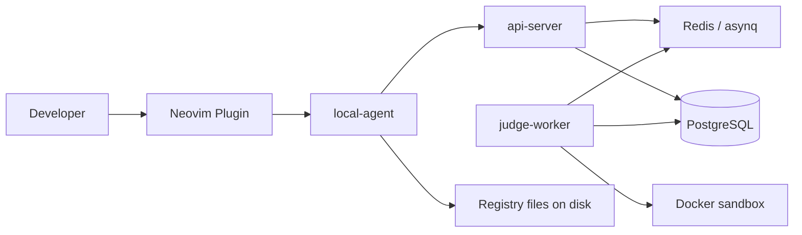
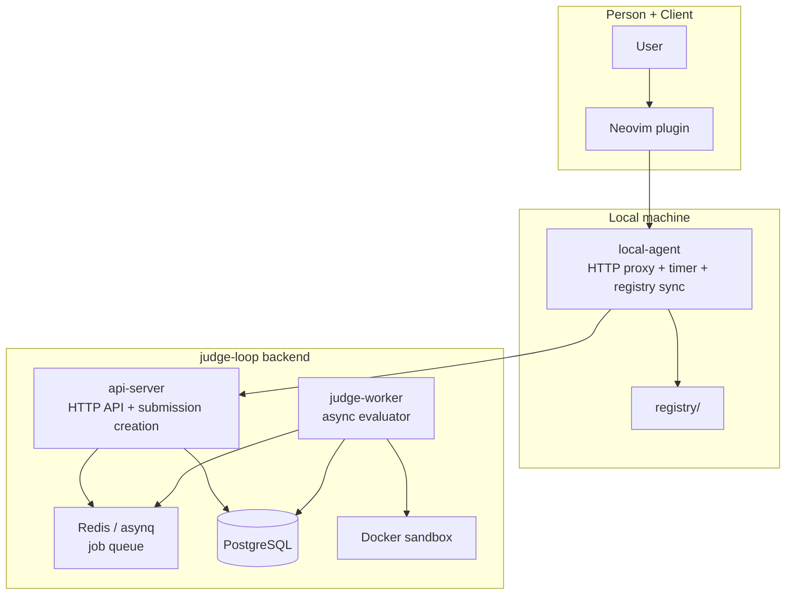
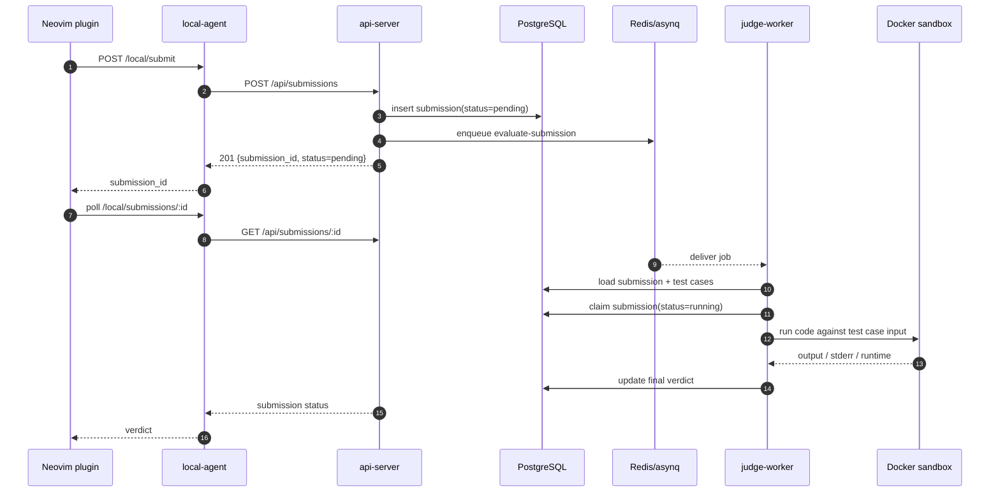
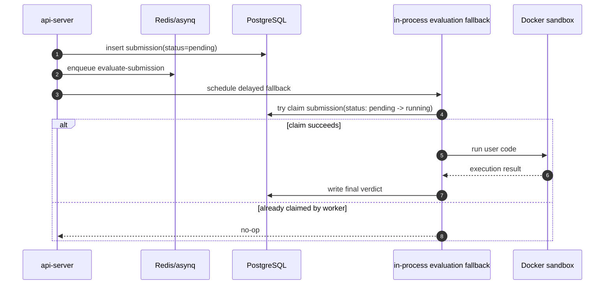
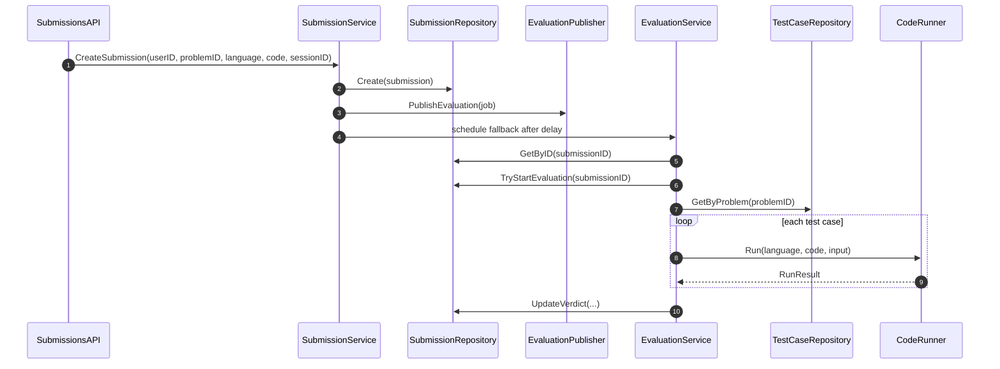
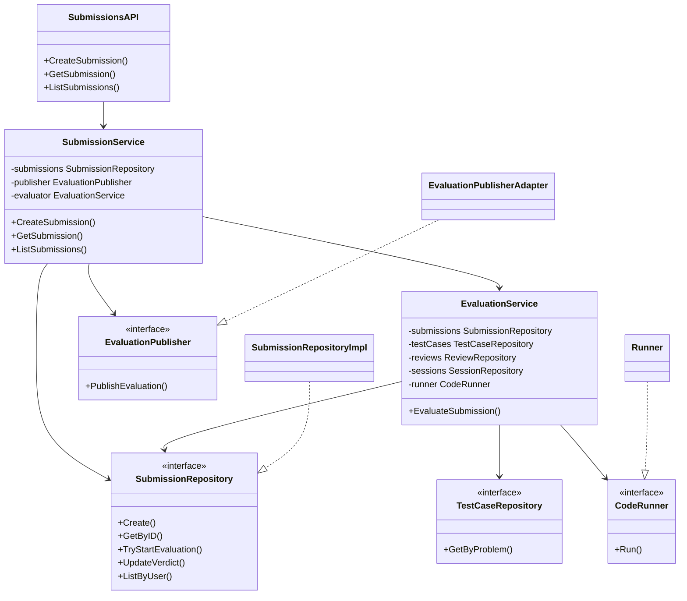

# Architecture

## Overview

`judge-loop` now uses a clear ports-and-adapters structure inside a single Go module.

The main runtime pieces are:

- `api-server` for HTTP reads/writes and queue submission
- `judge-worker` for async evaluation
- `local-agent` for editor-facing local workflows
- PostgreSQL for persistent state
- Redis/asynq for background jobs
- Docker sandbox for code execution

```
Neovim plugin
  -> local-agent
  -> api-server
  -> Redis/asynq
  -> judge-worker
  -> Docker sandbox
  -> PostgreSQL
```

## Diagrams

### System Context



### C4-Style Container View



### Submission Sequence



### Fallback Sequence

This is the intended resilient path when no external worker claims the queued job in time.



## Dependency Rule

The package graph is organized so dependencies point inward:

- `cmd/*` wires dependencies and starts processes
- `adapter/*` translates external inputs/outputs
- `application/*` contains use-case orchestration
- `domain/*` contains core domain types and pure logic
- `port/in` exposes application capabilities to adapters
- `port/out` defines infrastructure dependencies required by the application
- `infrastructure/*` provides concrete implementations of outbound ports

Adapters and infrastructure should not own business rules. Entry points should not contain use-case logic.

## Package Layout

Single Go module: `github.com/tuannm99/judge-loop`

| Package                              | Responsibility                                                       |
| ------------------------------------ | -------------------------------------------------------------------- |
| `cmd/api-server`                     | process entrypoint and dependency wiring for the HTTP API            |
| `cmd/judge-worker`                   | process entrypoint and dependency wiring for async evaluation        |
| `cmd/local-agent`                    | process entrypoint and dependency wiring for the local daemon        |
| `internal/domain`                    | domain entities and value types                                      |
| `internal/domain/judge`              | pure verdict evaluation logic                                        |
| `internal/application`               | application use cases, orchestration, and mission-generation helpers |
| `internal/port/in`                   | inbound ports implemented by application services                    |
| `internal/port/out`                  | outbound ports implemented by adapters/infrastructure                |
| `internal/adapter/http`              | Gin handlers for `api-server` and `local-agent`                      |
| `internal/adapter/queue`             | asynq-facing adapters for publish/consume flow                       |
| `internal/adapter/sandbox`           | code runner adapter used by application services                     |
| `internal/infrastructure/postgres`   | GORM repositories and embedded goose migrations                      |
| `internal/infrastructure/queue`      | asynq task definitions and queue setup                               |
| `internal/infrastructure/sandbox`    | Docker-based code execution                                          |
| `internal/infrastructure/registry`   | local registry manifest loading from disk                            |
| `internal/infrastructure/localtimer` | in-memory timer for the local-agent                                  |

## Service Roles

### `api-server`

- exposes the HTTP API on port `8080`
- uses application services behind `port/in`
- persists state through postgres-backed repository adapters
- publishes evaluation jobs through the queue adapter

### `judge-worker`

- consumes evaluation jobs from Redis/asynq
- calls the evaluation application service
- runs code through the sandbox adapter
- writes final verdicts back through repositories

### `local-agent`

- exposes local HTTP endpoints on port `7070`
- keeps an in-memory local timer
- proxies submissions to `api-server`
- loads registry manifests from local disk and pushes them to the server

## Submission Flow

```
Neovim
  -> POST /local/submit
  -> local-agent forwards to POST /api/submissions
  -> api-server creates submission row
  -> api-server enqueues evaluation job
  -> judge-worker consumes job
  -> evaluation service loads submission + test cases
  -> sandbox runs code
  -> domain judge logic computes verdict
  -> submission row updated in PostgreSQL
```

## Low-Level Design

### Low-Level Sequence



### Low-Level Class Diagram



## Persistence and Migrations

PostgreSQL is the source of truth for submissions, sessions, reviews, and registry versions.

- ORM: GORM
- migrations: goose
- migration path: `internal/infrastructure/postgres/migrations`
- migrations run automatically on service startup

## Testing

Application-layer tests are built around split ports and generated mocks:

- mock generator: `mockery v3`
- assertion library: `testify`
- mock packages:
  - `internal/port/in/mocks`
  - `internal/port/out/mocks`

## Assumptions

- single-user MVP, no auth boundary yet
- local-agent runs on the developer machine
- problem metadata is stored, not full problem statements
- Docker must be available where `judge-worker` runs
